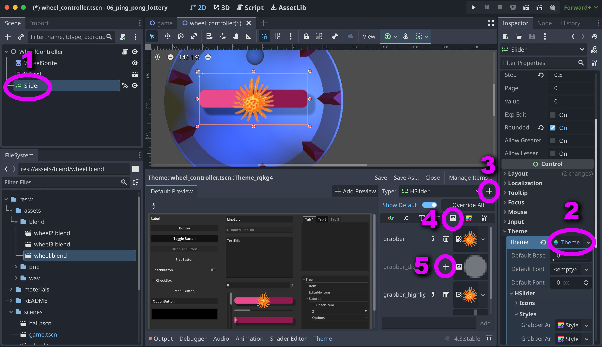
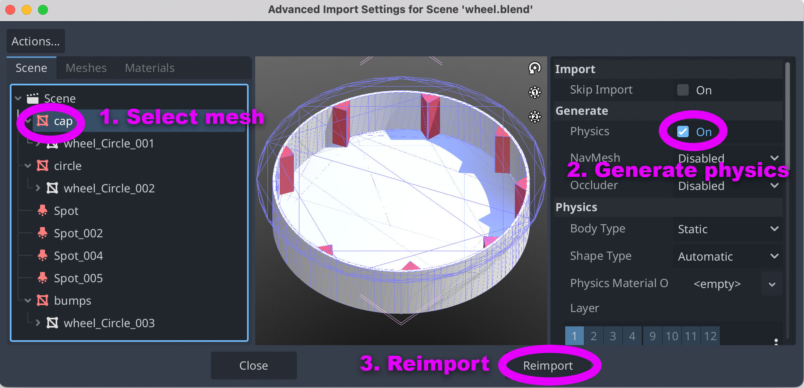

# 06 Ping Pong Lottery

Demonstrates how to combine 2D and 3D scenes using SubViewport. Uses a (themed)  UI to control properties of a 3D scene. Includes Blender files.

## Subviewport

By placing nodes within a subviewport, you cause them to be rendered separately from the main scene. This data can be used as an image texture (which in turn can be attached to sprite), essentially creating a little window in to another scene. Because the two scenes are not linked in any way beyond the image data, 2D and 3D scenes can be shown in the same window.

**NOTE:** : As of version 4.3, Godot has a bug where a 2D sprite whose texture is a 
SubViewPort that displays 3D content will sometimes lose track of _which_ SubViewPort is the texture.  

For this project, that means that whenever you edit wheel.tscn, you will likely
have to go in to wheel_controller.tscn, select `WheelSprite` and then re-set the
Viewport Path to "Wheel".  More generally, if you use this method and your SubViewPort is missing for some reason, you may need to re-select it in your Sprite's texture field.

(Thankfully, this bug does not appear to affect updates to the 3D model itself,
which should just automatically re-import each time a change is made in Blender.)

## UI Theming

To add custom textures to your UI components, follow the steps below: 

1. Select the UI component you would like to change.
2. Create a new theme by clicking in the "Theme" box.
3. Click the "+" to create an override for your specific UI node (in this case, HSlider)
4. Select the tab that corresponds to the kind of change you'd like to make. (ie, textures)
5. Click the "+" beside the state you would like to update.




## Working with 3D

### Blender Importing
Godot is able to work directly with Blender files, and has a built-in importer that you can access by double-clicking the .blend file within the FileSystem pane.   The first time you use this importer, you will be asked to find a Blender executable to run this importer, find the Blend excutable inside the app, the path for which should look like this : 

```
# Windows example path:
C:/Program Files/Blender Foundation/Blender 3.2/blender.exe.

# MacOS example path:
/Applications/Blender.app/Contents/MacOS/Blender
```

### Adding Collisions

With the importer open, select each mesh you would like to collide with and select the "Generate physics" button. Once you are done, click "Reimport".   



### Detecting 3D collisions

To detect what part of a 3D object has been collided with, you'll need to peek inside the path of the body that is doing the colliding. This is passed in to the collision signal by default, so you can just check to see if that path contains the name of the mesh like so: 

```gd
func _on_body_entered(_body: Node) -> void:
	var path = str(_body.get_path())
	if "bumps" in path:
      print("Collided with a mesh called bumps")
  ```

Check out `scripts/ball.gd` to see the full process.


## Credits
This demo was created by [Nate Laffan](https://github.com/laffan).