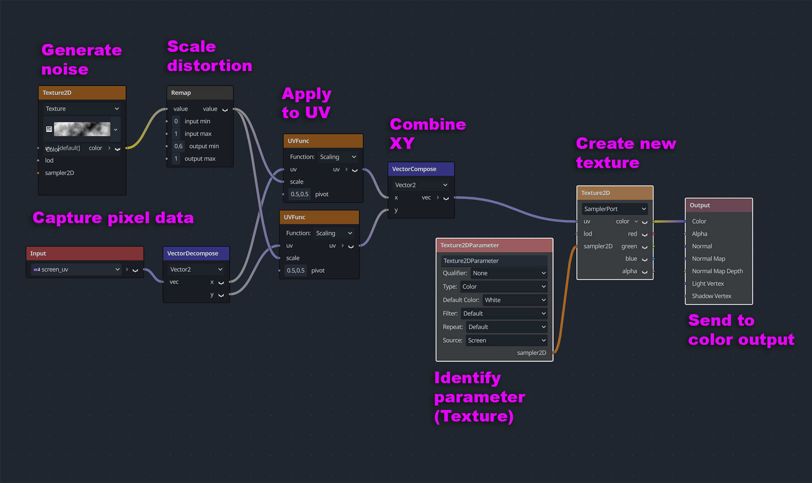

# 09 Throw Shade

This demo introduces basic shading.  There are five shaders zones in all, and you can use arrow keys to move your character in to each zone. Four use GDSL (Godot Shader Language), which is heavily based on OpenGL Shading Language (GLSL). The fifth uses Godot's visual shading tool, which compiles to the GDSL.

## Using shaders in your scene

The easiest way to use a shader is via the `ColorRect` node.  This node has a "Material" field (CanvasItem > Material) to which a shader can be attached. Anything that is below the ColorRect will be affected by the shader.

To create a new shader, navigate to the CanvasItem > Material field in the inspector and click <empty>. Then select New ShaderMaterial. Beneath the sphere that appears, there is a field for "Shader" with another <empty> beside it. Click <empty> and select New Shader. The dialog box that pops up lets you create two types of shader : Shader (GDSL) and Visual Shader.  In both cases, make sure "Mode" is set to "Canvas Item."

Below is a brief description of each option.

## Shader (GDSL)

The actual nuts and bolts of how shaders work is beyond the scope of this README, but I highly recommend [The Book of Shaders](https://thebookofshaders.com/) for a clear beginner tutorial. The Book of Shaders deals with GLSL, but all of the concepts explained will apply to GDSL.  

The four shaders that are used in this demo have fairly extensive commenting, should you want to edit them and use them in your own projects.

## Visual Shader

The visual shader in the demo (top) can be viewed by double clicking the `/shaders/3_Visual_Shader_ex.tres` file, which should bring up the Shader Editor window. It looks like this : 

In this example, a noise texture is generated.  Noise values go from 0-1 (0 = black, 1 = white), so a remap node is used to scale the noise to be less extreme. 

The input texture (ie. whatever its beneath the `ColorRect` box) is then passed in and multiplied to this noise texture. In this way, each pixel is shifted the amount of the noise value that has been mapped on to it. 

These pixels are then combined in to a new texture, which becomes the color of the output material. 

## Credits
This demo was created by [Nate Laffan](https://github.com/laffan).